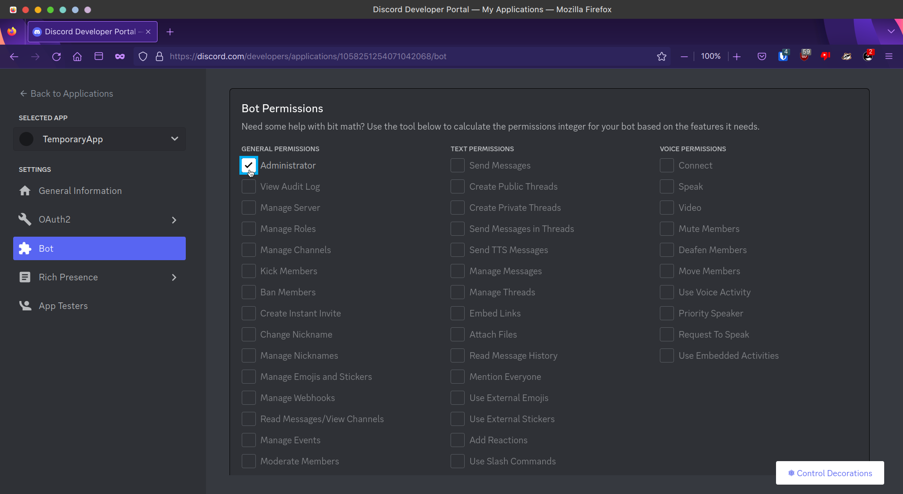
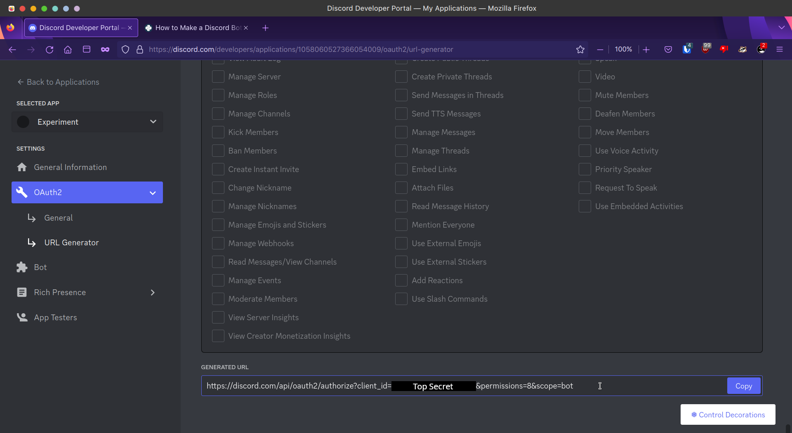

# DiscordBotExperiment
Experimenting with [`discord.py`](https://github.com/Rapptz/discord.py) since the last time I created a bot was 2 years ago and it was written in javascript.

In addition, this is supposed to serve as a reference for a simple discord bot for my friends so there is going to be alot of documentation for this project.

This README may get quite long so I have created a simple contents page:

 - [Usage Instructions](#usage-instructions)
    - [Getting started](#getting-started)
    - [Software requirements](#software-requirements)
    - [Virtual environments](#virtual-environments)
    - [Installing dependencies](#installing-dependencies)
    - [Setting up discord](#setting-up-discord)
    - [Running the bot](#running-the-bot)
 - [Project Structure](#project-structure)

## Usage Instructions

### Getting started

You can either `git clone` or download and extract a zip file of this repository to your machine. I'd recommend git cloning it so that you can continuously receive updates by running `git pull origin` in the terminal.

I'll be using `/path/to/repository` as the example path for this README. This will be different on your machine. If you cloned or extracted the repository to `C:\Users\renoir\DiscordBotExperiment`, then substitute `/path/to/repository` with that instead.

### Software requirements

The most basic software requirements you need are [`python`](https://www.python.org) and [`venv`](https://docs.python.org/3/library/venv.html). Ideally you'd want to have the latest version of python possible. For reference, my system has version 3.10.9 installed. `venv` should be installed by default during python's installation process since it is part of the standard library. Make sure that python is added to path so that you don't have to use the full path to call python in the terminal.

### Virtual environments

Python's `venv` module allows you to create small python virtual environments so that you don't pollute your system's python installation. You may skip this step but personally I prefer using `venv` to keep everything in its place.

To begin, open a terminal and type in:

#### *Windows (PowerShell), MacOS or Linux*

```sh
cd /path/to/repository
python -m venv venv/
```

Now that you have created a virtual environment, you must enter the virtual environment. Do note that once you are inside, the python program and all of the modules associated with it will be from the virtual environment, not the one your system uses.

#### *Windows (PowerShell)*

```bat
venv\bin\Activate.ps1
```

#### *MacOS or Linux (Bash/Zsh)*

```sh
source venv/bin/activate
```

You should now see that your command prompt has changed, so instead of `/path/to/repository%` you might see `(venv) /path/to/repository%`. This lets you know that you're in the virtual environment.

To exit, just type `deactivate` in your terminal. Your command prompt should return to normal.

### Installing dependencies

This project uses [setuptools](https://github.com/pypa/setuptools) as the build system to manage dependencies, package the project as well as provide a framework for the project to grow. You can install it using:

#### *Windows (PowerShell), MacOS or Linux*

```sh
python -m pip install -U setuptools
python -m pip install -U build
```

You can now install the project's dependencies:

#### *Windows (PowerShell), MacOS or Linux*

```sh
python -m pip install --editable .
```

or

```sh
python setup.py develop
```

### Setting up discord

If you don't have a discord account, please create one.

Next login to [discord.com](https://discord.com) in your browser and head over to the [Developer Portal](https://discord.com/developers/applications). The dev portal should look something like this:


Once you're there, click on the **New Application** button in the top right. Give your application a name, accept T&Cs and click **Create**.

You should now be redirected to your app's *General Information* page.


Go to **Bot** and click on **Add Bot**.


And you should be able to see your new bot. Here, you can change the name of your bot and manage your bot's tokens.


Scroll down and allow the bot to use *Privileged Gateway Intents*. Since our bot is only going to be added on one server only, we do not need verification.


Scroll down once again to give your bot permissions. Here I have selected the **Administrator** permission because I am lazy. In practical applications, you should never do this.



Next, click on OAuth2 and click on **AUTHORIZATION METHOD**, select **In-app Authorization**.

Select `bot` as your **scope** and select the same **bot permissions** you used before.

Now, go to **URL Generator** and select your scope and bot permissions again. When you scroll all the way to the bottom, you will see a custom URL generated for your bot. If you click on the link, you will be able to add the bot to your server.



Go back to **Bot** and click on **Reset Token**. You should get a long and cryptic string that acts like a password that lets your program take control of your bot. Copy the token and store it in a file that you can access later. If you're using git, make sure you add that file to .gitignore so it doesn't appear in public. If your token does get leaked, however, you can still regenerate a new token.


### Running the bot

Let's say your token is stored in a file at `/path/to/token`, use this command the run the bot.

#### *Windows (PowerShell), MacOS or Linux*

```sh
python -m discordbot /path/to/token
```

Alternatively, you can have your token stored as an environment variable. In that case, you don't have to pass the token's file path as part of the command to the terminal.

```sh
python -m discordbot
```

## Project Structure

This section serves to explain what the files and folders in this repository are for.

### `README.md`

Main bit of documentation and the first thing you'll see on this repository's GitHub page.

### `LICENSE`

GPLv3

### `.gitignore`

Specifies which files and folders to exclude from the git repository. This allows you to have personal files stored in your local copy of the repository without having them appear in public.

### `pyproject.toml`

Most python packages have a `pyproject.toml`. It specifies how such packages are supposed to be built. It's somewhat analogous to Node's `package.json`.

### `setup.py`

A script that builds the `discordbot` package.

### `setup.cfg`

General information that `setup.py` picks up to build the package.

### `.vscode/settings.json`

Workspace specific settings for Visual Studio Code.

### `discordbot/`

Folder where the actual code is stored.

### `discordbot/__init__.py`

Marks the `discordbot/` folder as a module. `main()` is defined in this file.

### `discordbot/__main__.py`

This file is run when you type in `python -m discordbot` in console.

### `discordbot/client.py`

Contains the code for the bot, its commands and how to run it.

### `discordbot/utils.py`

Extra code that might be useful for the bot.

### `doc/`

Folder for documentation.
